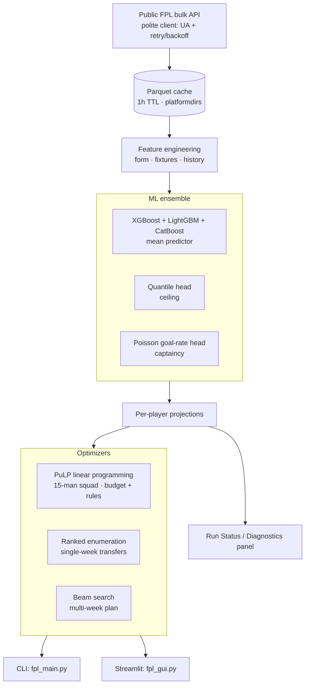

# Architecture — FPL Ultimate Analyzer

## Notes
- **One model, three decisions**: the same projections drive squad build, transfers, and multi-week planning.
- **Constraints as math**: budget, position quotas, and max-3-per-club are encoded as LP constraints, not heuristics.
- **Reproducible**: Parquet cache + time-pinned tests make runs deterministic within the TTL window.
